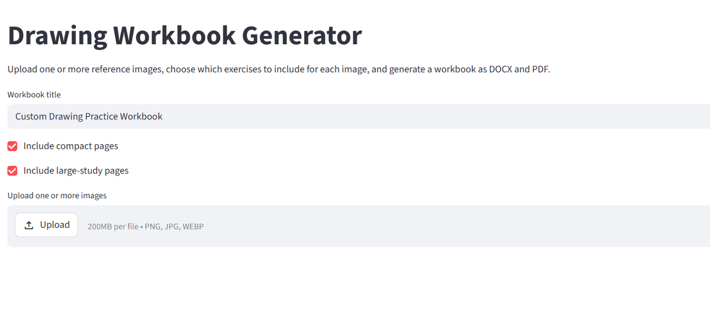
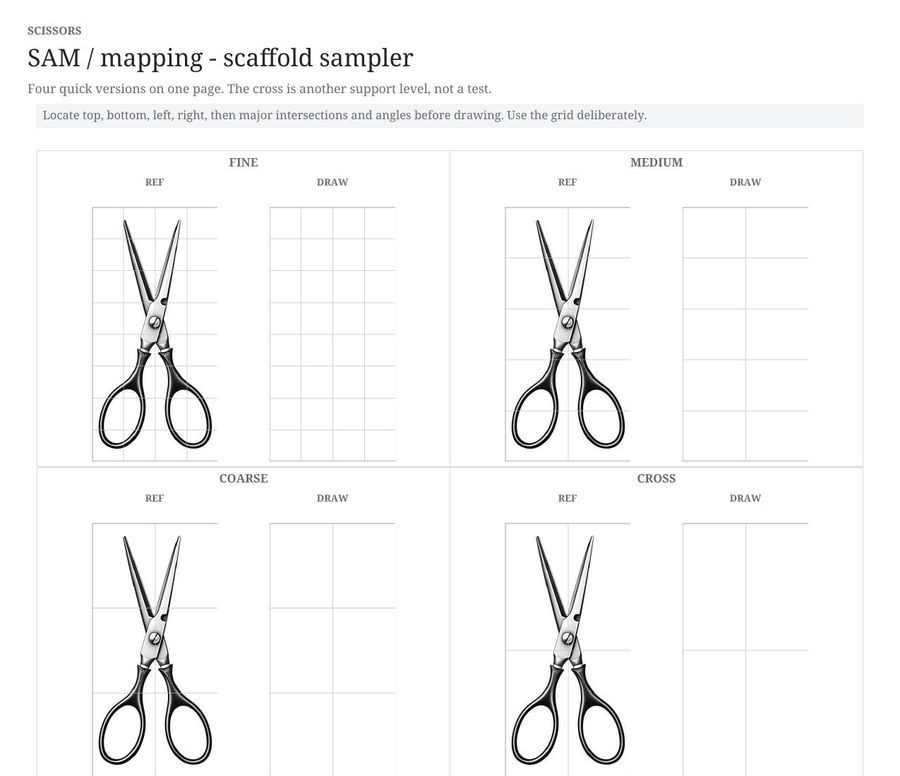
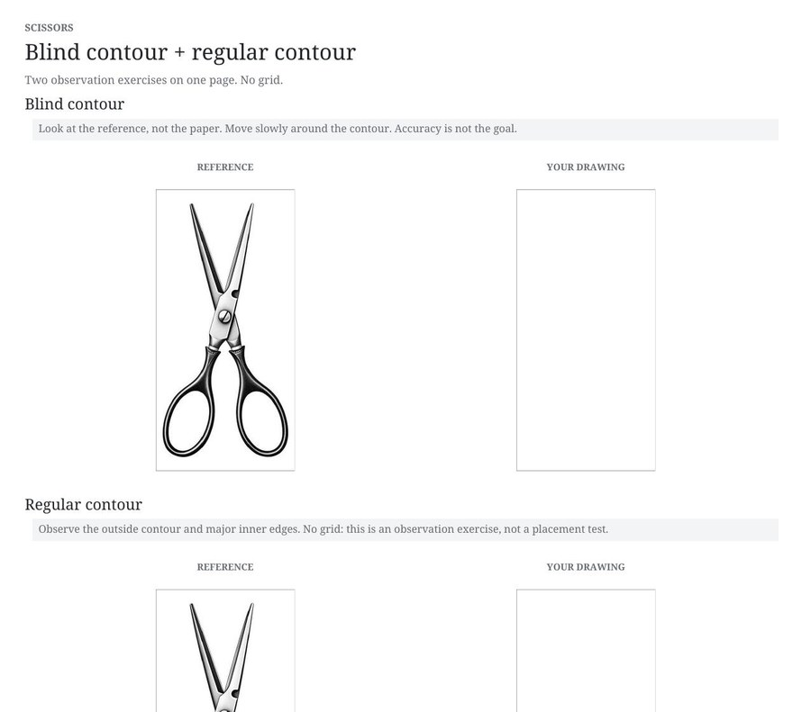

# Drawing Workbook Generator

A small Streamlit app for turning one or more reference images into printable black-and-white drawing-practice workbooks.

The idea is to make the transition from highly structured drawing exercises to more independent drawing **gradual rather than abrupt**. The same perceptual skills can be repeated across increasingly complex references while placement support fades in stages.



## What the generator can make

For each uploaded image you can choose any combination of:

1. **Blind contour** — no grid; observation only
2. **Regular contour** — no grid; observation only
3. **SAM / mapping** — sighting, angles, and mapping with scaffold support
4. **Upside-down drawing** — reduces object-labeling while keeping placement support
5. **Negative space** — draw the empty shapes around and between forms
6. **3-value study** — simplify the image into dark, middle, and light
7. **5-value study** — a more developed value plan
8. **Progressive focus** — work on one evolving drawing from very blurred to sharp
9. **Integrated study** — combine the process with only a light center-cross scaffold

The supported exercises can be generated as both compact same-page studies and larger practice pages.

## Why the grids change

The scaffold is deliberately reduced in stages instead of disappearing all at once:

**fine grid → medium grid → coarse grid → center cross**

That makes it possible to change one source of difficulty at a time.



## Example: contour exercises

Blind contour and regular contour are treated as observation exercises, so they intentionally do **not** use a grid.



## Image input

The app accepts **PNG, JPG/JPEG, and WEBP** files through drag-and-drop or the file browser.

It also accepts images directly from the clipboard. Press **Ctrl+V anywhere on the app page** after copying an image. On Windows, use **Win + Shift + S** to make a screen clipping, return to the app, and press **Ctrl+V**. The screenshot is imported as PNG, so it never has to be saved as a file first. Multiple clipboard images can be pasted one after another.

Normal text paste is left alone: the app only intercepts clipboard pastes that actually contain an image.

## Image framing

Each reference image can use one of three framing modes:

- **Auto frame** — trims obvious unused outer background before sizing the exercise boxes
- **Crop manually** — interactive draggable/resizable crop box, with free or fixed aspect ratios
- **Use full image exactly** — preserves the complete uploaded image and its existing whitespace

A manually approved crop is used consistently for every derived exercise.

## Printing layout

The app has two print-layout modes:

- **Duplex - facing pages** (recommended): designed for ordinary double-sided printing with **Flip on long edge**. Full-page references are forced onto even-numbered left pages and their matching drawing grids onto the following odd-numbered right pages, so they face each other rather than printing back-to-back. If page parity needs correcting, the generator inserts a simple extra-practice page instead of an empty page.
- **Single-sided**: generates pages in normal sequence without duplex parity adjustments.

For **Progressive focus**, duplex mode uses one efficient two-page spread: all four reference stages appear on the left page and one large evolving drawing grid is on the facing right page. This preserves the intended one-drawing exercise without putting a reference on the reverse of the drawing sheet.

## Multiple images and downloads

You can upload several reference images at once and choose different exercises for each.

Output options:

- **One merged workbook** — all selected images in one PDF
- **Separate workbook for each image** — one PDF per reference
- **Both** — merged PDF plus separate PDFs

Separate workbooks can also be downloaded together as a ZIP. Download names include the uploaded image filename so repeated generations are easier to distinguish.

## Output

PDFs are generated directly in Python with ReportLab. No LibreOffice or Word installation is required.

The generator:

- derives drawing-box proportions from the actual reference image
- keeps matching reference/drawing areas at the same aspect ratio
- supports compact and large-study versions
- creates grids relative to the image proportions rather than forcing every image into a fixed 5×7 frame
- keeps the entire workflow black-and-white for now

## Run locally

### 1. Clone the repository

GitHub Desktop is the easiest option if you do not use Git from the command line regularly.

### 2. Open a command window in the repository folder

In File Explorer, open the repo folder, click the address bar, type:

```text
cmd
```

and press Enter.

### 3. Install dependencies

```bat
python -m pip install -r requirements.txt
```

### 4. Run the app

```bat
python -m streamlit run app.py
```

The app should open automatically in your browser.

## Streamlit Cloud

This repository can also be deployed on Streamlit Community Cloud using `app.py` as the entry point. Once deployed, pushing updates to the GitHub repository will trigger a redeploy automatically.

## Repository files

- `app.py` — Streamlit user interface
- `workbook_generator_backend_duplex_v2.py` — image processing and direct PDF generation
- `example_build.py` — small programmatic example
- `requirements.txt` — Python dependencies
- `assets/` — screenshots used in this README

## Current design philosophy

The workbook process is intentionally repetitive. A learner can practice the **same skill several times on the same image**, then use the same process on a more complex image. The goal is to build a repeatable approach to new subjects rather than jump from a constrained exercise directly to an unsupported blank page.

## Possible next steps

- reorder uploaded images before generation
- save/load exercise settings as a preset
- estimate page count before generating
- per-image presets such as “simple object,” “organic form,” and “full study”
- later: optional color-study exercises


## Deployment note

The current app imports the versioned backend `workbook_generator_backend_duplex_v2.py`. This avoids accidentally loading an older backend file that may still exist in a deployed repository. The app shows **Generator backend: duplex-v2** near the top when the update is active.
